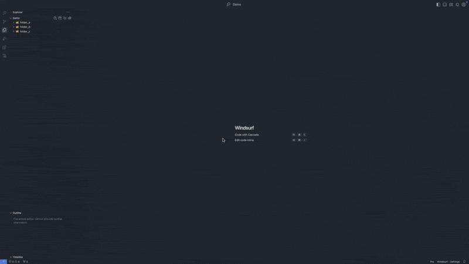
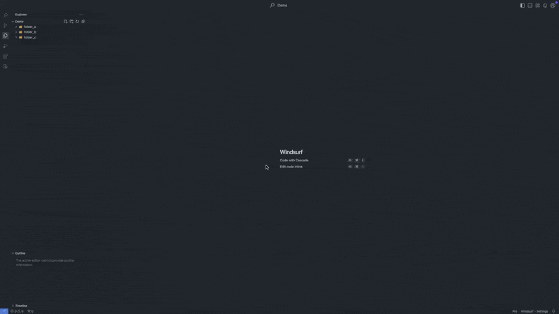
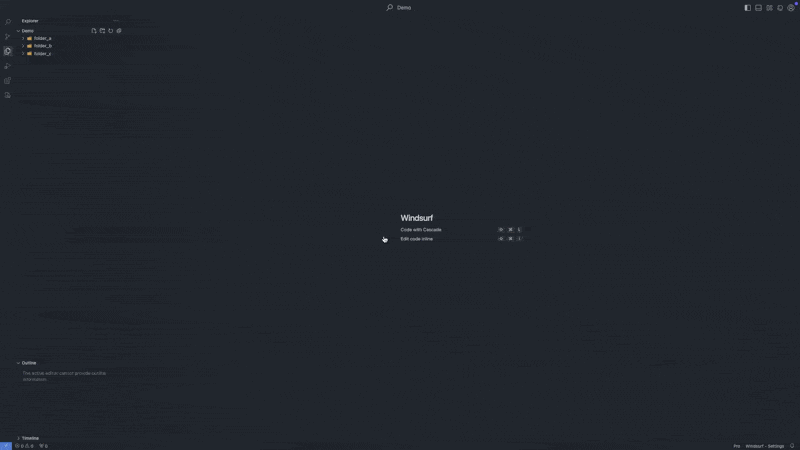

# Image Finder README

This extension is to help user to find and view images in the workspace quickly.

## Features

- Scan images in the workspace
- Display images in the activitybar
- Display image details in the details view
  - Reveal image in explorer
- Find similar images

> Current supported image formats are: ['.png', '.jpg', '.jpeg', '.gif', '.bmp', '.webp', '.svg', '.ico']

## Requirements

- VS Code 1.94.0 or higher

## How to Use

### View Images

- View All Images

  

- View Specific Folder Images

  

  > You can add multiple folders in the setting

- Find Similar Images

  

  > The search research is based on the items in view images

**Enjoy!**
